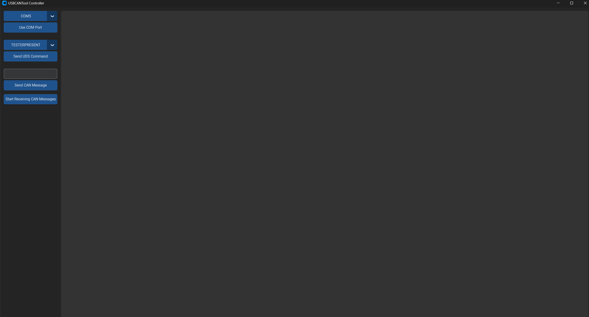

# UDSCANTool

This repo contains code for a standalone UDS (ISO 14229-1) diagnostic tester built for a STM32 Nucleo-G474RE. The nucleo board
can generated UDS messages over ISO-TP (ISO 15765-2) on a CAN 2.0B bus, and is interactable vai a
serial terminal or from the included Python GUI over the ST-Link virtual port.

---

## 1. Overview

### 1.1 What it does

The nucleo board acts as a **UDS client (tester)**. You can issue a command from the terminal/GUI, the nucleo board 
inteprets it, assembles the UDS message then sends it over CAN via iso-tp. The nucleo board then receives the response
from the UDS server and sends it over UART. 

Current capabilities:

- **Raw CAN** — send a CAN frame (up to 8 bytes) and view CAN messages from the bus. 
- **UDS TesterPresent** (SID `0x3E`) — UDS keep alive command used by most ECUs. 
- **UDS VIN read** — ReadDataByIdentifier (SID `0x22`) to read certain values such as the VIN. 
- **Negative response decoding** — NRCs are translated to readable text rather than raw bytes.

Addressing is  1 to 1: the tester transmits on **`0x7E0`** and accepts responses on
**`0x7E8`** (see [cli.h](App/cli/cli.h)). The bus runs at **500 kbit/s**, classic CAN, 11-bit
identifiers.

For the full requirement list see [Docs/PROJECTREQUIREMENTS.md](Docs/PROJECTREQUIREMENTS.md);
for requirement implementation status see [Docs/TRACEABILITY.md](Docs/TRACEABILITY.md).

### 1.2 Architecture

The firmware is layered so that everything above the HAL wrapper is portable to other platforms:

```
        Host (PC)
  +-----------------------+
  |  GUI/main.py          |  customtkinter GUI
  |  Contract/            |  pyserial wrapper + shared constants
  +-----------+-----------+
              |  USB  (ST-Link VCP, 115200 8N1)
  ============+====================================  Nucleo-G474RE
              |
  +-----------v-----------+
  |  App/cli              |  command parser / console loop
  +-----------------------+
  |  App/uds              |  UDS service layer (SIDs, NRCs, P2 timing)
  +-----------------------+
  |  App/isotp-c          |  ISO-TP segmentation (isotp-c + port layer)
  +-----------------------+
  |  App/can   App/uart   |  portable CAN / UART interfaces
  +-----------------------+
  |  Core/Src/*_hal_*.c   |  STM32G474RE HAL implementations
  +-----------+-----------+
              |  CAN TX/RX (PA12 / PA11)
  +-----------v-----------+
  |  SN65HVD230           |  CAN transceiver
  +-----------+-----------+
              |  CAN_H / CAN_L twisted pair, 120 ohm at each end
       ECU / CANable / second board
```

### 1.3 Repository layout

| Path | Contents |
| --- | --- |
| [App/cli/](App/cli/) | Console loop, command dispatch, and peripheral bring-up order |
| [App/uds/](App/uds/) | UDS request building, response/NRC parsing, timing config |
| [App/isotp-c/](App/isotp-c/) | Vendored [isotp-c](https://github.com/lishen2/isotp-c) library plus wrappers (`isotp_port.c`, `isotp_user.c`) |
| [App/can/](App/can/) | CAN interface and ring buffer(`CANInit`, `CANSend`, `CANReceive`) |
| [App/uart/](App/uart/) | UART interface and ring buffer|
| [Core/Src/](Core/Src/) | STM32G474RE HAL implementations of the above interfaces plus the CubeMX-generated startup code |
| [Utils/](Utils/) | Utility functions: `Status` codes, logger, timer, LED, critical sections |
| [GUI/](GUI/) | Python GUI application |
| [Docs/](Docs/) | Requirements and traceability |
| [Drivers/](Drivers/) | ST HAL and CMSIS (vendored, do not edit) |

### 1.4 Conventions

- **Error handling.** Every function that requires error handling returns a `Status` enum from
  [Utils/status.h](Utils/status.h) (`STATUS_OK`, `STATUS_TIMEOUT`, `STATUS_PROTOCOL_ERROR`, ...).
  Callers propagate it upward while the CLI is the only layer that turns a `Status` enum into text sent over 
  UART. 
- **Logging.** `LOG_ERROR` / `LOG_WARN` / `LOG_INFO` in [Utils/log.h](Utils/log.h) writes into a
  ring buffer that is sent over UART outside of interrupts `logDrain()`. This keeps
  ISRs free of blocking I/O.
- **Hardware abstraction.** Nothing under `App/` includes an STM32 specific code Porting to another
  MCU requires you to reimplement the `*_hal_*.c` files in `Core/Src/`.
- **Interrupt-driven RX.** CAN and UART bytes are stored in ring buffers from their ISRs and
  the application polls those buffers. 

### 1.5 Branches

Two branches exist: **`master`** and **`in-progress`**. Minor changes are pushed into `in-progress` which is merged into
`master` once tested as required by [Docs/PROJECTREQUIREMENTS.md](Docs/PROJECTREQUIREMENTS.md).

---

## 2. Hardware

### 2.1 Bill of materials

| Item | Purpose | Notes |
| --- | --- | --- |
| ST Nucleo-G474RE | Main board (STM32G474RET6, 170 MHz) | Has an FDCAN controller but **no** on-board transceiver |
| SN65HVD230 breakout | CAN transceiver | requires 3.3V only so it works with the G474 |
| 2 x 120 ohm resistors | Bus termination | Place one at each end of the CAN bus |
| Twisted pair wire | CAN_H / CAN_L | Try to keep wire length short |
| CANable (or second Nucleo) | Counterpart under test | Acts as the UDS server / traffic source |
| USB Micro-B cable | For Power, flashing, and the serial console | The ST-Link works with the CLI so that no extra USB-UART adapter is needed |

### 2.2 Pin assignment

| Signal | Pin | Peripheral | Goes to |
| --- | --- | --- | --- |
| CAN RX | PA11 | FDCAN1_RX (AF9) | SN65HVD230 `RXD` |
| CAN TX | PA12 | FDCAN1_TX (AF9) | SN65HVD230 `TXD` |
| Console TX | PA2 | LPUART1_TX | ST-Link VCP |
| Console RX | PA3 | LPUART1_RX | ST-Link VCP |
| Status LED | PA5 | GPIO output | On-board LD2 |
| SWDIO / SWCLK | PA13 / PA14 | SWD | On-board ST-Link |

Transceiver power: `3V3` and `GND` from the Nucleo's Morpho/Arduino headers.

### 2.3 Bus timing

Configured in [can_hal_stm32g474re.c](Core/Src/can_hal_stm32g474re.c): FDCAN is clocked from
 for **500 kbit/s** with a sample point at roughly 88%. The frame format is classic CAN
with bit-rate switching off.

## 3. Building and running

### 3.1 Firmware

**Requirements:** [STM32CubeIDE](https://www.st.com/en/development-tools/stm32cubeide.html)
**1.19.0**. Newer versions should work but are untested.

1. `File > Open Projects from File System...` and select the repository root. The project is
   recognized from `.project` / `.cproject`; do **not** use `Import > Existing Project` on a copy
   of the folder.
2. Connect the Nucleo over USB Micro-B (the `CN1` ST-Link connector).
3. `Project > Build Project` (Ctrl+B). Artifacts will land in `Debug/` (git-ignored).
4. `Run > Debug As > STM32 C/C++ Application`, or click Run to flash. 

Peripheral configuration lives in [UDSCANTool.ioc](UDSCANTool.ioc). Regenerating from CubeMX
rewrites `Core/Src/main.c` and `Core/Src/stm32g4xx_hal_msp.c`, so you should keep any custom code inside the
`USER CODE BEGIN/END` comments. Generally, it is not recommended to regenerate any code. 

Key compile-time macros:

| Macro | File | Default |
| --- | --- | --- |
| `UART_BAUD_RATE` | [App/uart/uart.h](App/uart/uart.h) | `115200` |
| `UARTRingBufMaxSize` | [App/uart/uart.h](App/uart/uart.h) | `150` |
| `CANRingBufMaxSize` | [App/can/can.h](App/can/can.h) | `16` |
| `CAN_CLIENT_TX_ID` / `CAN_SERVER_RX_ID` | [App/cli/cli.h](App/cli/cli.h) | `0x7E0` / `0x7E8` |
| `UDS_P2_CLIENT_MS` | [App/uds/uds_cfg.h](App/uds/uds_cfg.h) | `50` |
| `UDS_P2_STAR_CLIENT_MS` | [App/uds/uds_cfg.h](App/uds/uds_cfg.h) | `5000` |
| `MAX_UDS_MSG_SIZE` | [App/uds/uds_cfg.h](App/uds/uds_cfg.h) | `100` |
| `LOG_LEVEL` | [Utils/log.h](Utils/log.h) | `LOG_LEVEL_INFO` |

If you change `UART_BAUD_RATE` the GUI detects the change automatically because it parses the macro
from header file directly (see 3.3).

### 3.2 Using the serial console

Any terminal should work (PuTTY, `screen`, the CubeIDE terminal) but only PuTTY has been tested. Open the ST-Link virtual COM port at a baud rate of **115200**. The board prints `Enter CMD` when it is ready for input.

Every command is structured as `KEYWORD:ARGUMENT`. NOTE: The colon is mandatory. 

| Command | Effect |
| --- | --- |
| `UDS:TESTERPRESENT` | Send a TesterPresent request and print the response |
| `UDS:VIN` | Read DID `0xF190` and print the returned bytes |
| `CANS:<bytes>` | Transmit a raw frame on `0x7E0`, max 8 bytes |
| `CANR:` | Stream every received frame. Press any key to stop |

Example session:

```
Enter CMD
UDS:VIN
UDS response SID: 0x62 Containing: F1 90 31 47 31 ...
Enter CMD
```

A rejected request prints the decoded NRC for example: `UDS rejected: Service not supported`.

### 3.3 Running the GUI

**Requirements:** Python 3.11 or newer (3.13 is what the project is developed using) and the
packages in [GUI/requirements.txt](GUI/requirements.txt): `customtkinter`, `pyserial`,
`darkdetect`, `packaging`.

```bash
cd GUI
python -m venv venv
.\venv\Scripts\Activate.ps1 # Windows
pip install -r requirements.txt
python main.py
```

Start `main.py` from inside `GUI/` so the `Contract` package resolves.
[Contract/serial_layer.py](GUI/Contract/serial_layer.py) locates
[App/uart/uart.h](App/uart/uart.h) relative to the repository root and reads `UART_BAUD_RATE` out
of it at import time. That is the "contract" idea described in
[GUI/Contract/README.md](GUI/Contract/README.md): the firmware headers are the single source of
truth and the host code derives its settings from them instead of duplicating constants.

Workflow in the app:

1. Pick the ST-Link COM port from the top menu (the list should refresh every second).
2. Click **Use COM Port**.
3. Choose a UDS command and click **Send UDS Command**, type the CAN data as hex into the CAN entry and then send it,
   or click **Start Receiving CAN Messages** to stream traffic.

The GUI tracks board state and will block another command until the board has printed its
`Enter CMD` prompt again, so the board is not overloaded. 

> Close the GUI before opening a terminal on the same port, and vice versa. Only one process can
> hold the COM port.

### 3.4 Screenshot



*The host application: COM port selection, UDS command menu, raw CAN entry, and the output
console.*

### 3.5 Tests

Testing is currently a work in progress. 

### 3.6 Documentation

API documentation can be generated with Doxygen from [doxygen_config](doxygen_config):

```bash
doxygen doxygen_config
```

Output lands in `html/` and `latex/`, both git-ignored. Open `html/index.html` to browse.

---

## 4. TO-DO 
- Implement uds_client.c and uds_server.c in preparation of creating a test suite. 
- Create test cases using uds_client.c and uds_server.c. 
- Add more UDS commands to uds.c. 

## 4. Credits

ISO-TP segmentation is handled by [isotp-c](https://github.com/SimonCahill/isotp-c), placed under
[App/isotp-c/](App/isotp-c/) and wrapped to use this project's `Status` and logging conventions
through `isotp_port.c` and `isotp_user.c`.
